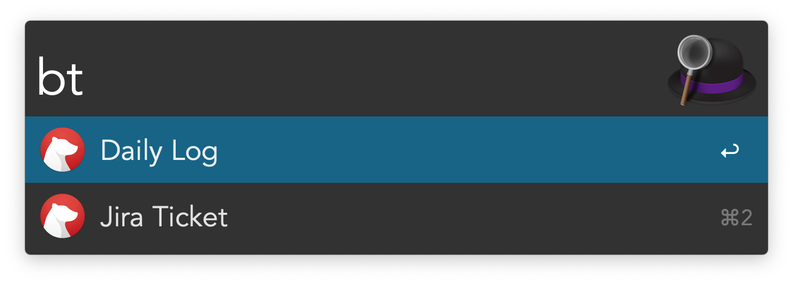
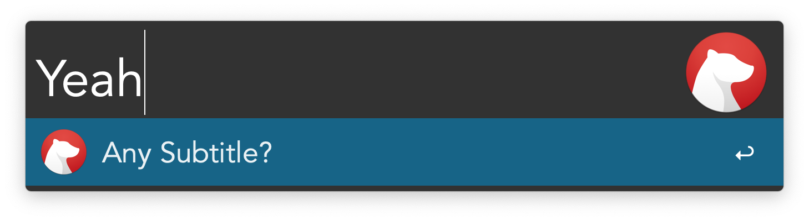

# Alfred Bear Workflow [](https://github.com/jmeischner/alfred-bear/actions/workflows/tests.yml)

This workflow should help to use templates in combination with the [bear](https://bear.app) app.

## Installation

```shell
npm install --global alfred-bear
```

## Usage

While creating note templates with static content can be useful, having the possibility to use dynamic placeholder from any source I want is really great.
That's why I built this workflow.

To get an idea how this work, take a look at template examples: the [Daily Log](https://github.com/jmeischner/alfred-bear-daily-log) or [Jira Ticket](https://github.com/jmeischner/alfred-bear-jira-ticket).

### Configuration

This workflow requires an `index.yml` file which contains a list and configuration of your templates.

The default workflow configuration directory is `~/.bear-templates` and can be changed by setting the `bearTemplateIndex` variable in the workflow settings.
The template directory can be synced e.g. with a .dotfiles repository, Dropbox, etc.  

This directory should contain a template index file (default: `index.yml`) and your templates.  

An example directory structure:

```
├──~/.bear-templates
│    ├── index.yml
│    ├── weekly-review
│    │   ├── template.md
│    │   └──script.js
│    ├── jira-ticket
│    │   ├── ticket.md
│    │   ├── ticket.js
│    │   ├── package.json
│    │   ├── node_modules
│    │   ├── diary.md
```

To create the `index.yml` in the expected default directory:

```shell
mkdir ~/.bear-templates/
touch ~/.bear-templates/index.yml
```

### The index.yml

An example of `index.yml` content:

```yml
templates:
  - title: "Daily Log"
    file: "alfred-bear-daily-log/Daily Log.md"
    script: "alfred-bear-daily-log/script.js"
    newWindow: false
    var:
      DATE_FORMAT: "YYYY-MM-DD"

  - title: "Jira Ticket"
    file: "alfred-bear-jira-ticket/Jira Ticket.md"
    ...
```

#### title

The `title` is shown in the template list:


#### file

Path to the template markdown file.
This file can contain 2 different styles of placeholder.

1. Normal Alfred [Dynamic Placeholder](https://www.alfredapp.com/help/workflows/advanced/placeholders/)
2. Placeholders with double curly braces `{{myPlaceholder}}` which follow the [Handlebars](https://handlebarsjs.com/guide/) syntax. These Placeholders could come from the `script`, `var` or `question` option.

First the _handlebars_ placeholders are replaced in the template and in the second step the dynamic placeholders from _alfred_.

#### script [optional]

Path to a _node.js_ module file. This module has to export a [optional async] function which returns an object, whose properties are placeholder keys.

To use other npm modules in this script, the script has to be a _node module_ by itself.
This means that templates can easily be shared as npm packages or repositories.

```js
// script.js
const rp = require("request-promise");

/**
 * [Async] function which gets the static variables
 * from the var option and the answer from
 * the optional question.
 */
async function greet(variables) {
  const data = await rp(variables.myRestApiEndpoint);
  return {
    myText: data.body,
  };
}

module.exports = greet;
```

#### newWindow [optional]

Should the new note opened in a separate window?

#### var [optional]

List of static placeholders for the template (e.g. APIToken, BaseUrl for REST Call etc.)

#### question [optional]

Sets a question to the workflow which asks for an additional placeholder value. To use the answer of this question in the template or script the placeholder key is `{{answer}}`.


## Example templates

If someone built a nice basis for a template, feel free to add it to this list and make a PR.

- [Jira Ticket](https://github.com/jmeischner/alfred-bear-jira-ticket)
- [Daily Log](https://github.com/jmeischner/alfred-bear-daily-log)
- [Create OKRs](https://github.com/jmeischner/alfred-bear-okrs)

# Development

To run and debug the project locally clone it then:

```shell
npm install
npm install -g
npm run dev
```

Workflow will be installed in alfred and symlinked to local files.
Project will be rebuilt on every file change by the `tsc` watcher.